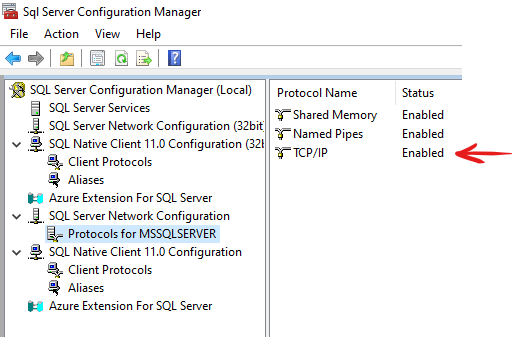

# 1. Instalar `azure-cli` y complemente de `aks`
Ejecutar desde powershell como administrador

`$ProgressPreference = 'SilentlyContinue'; Invoke-WebRequest -Uri https://aka.ms/installazurecliwindows -OutFile .\AzureCLI.msi; Start-Process msiexec.exe -Wait -ArgumentList '/I AzureCLI.msi /quiet'; Remove-Item .\AzureCLI.msi`

Instalar actualización de azure-cli

`az upgrade`

Instalar cliente de aks

`az aks install-cli`

Referencia: https://learn.microsoft.com/en-us/cli/azure/install-azure-cli


# 2. Autentificarse en los servicios de azure

### Iniciar sesión y usar suscripción azure
`az login`

`az account set --subscription 07fbccc0-xxxxx-xxxx-xxxx-xxxxxx`

## Iniciar sesión en azure container registry
`az acr login --name yyyyyyyyyy`

`docker login yyyyyyyyyy.azurecr.io`

dónde `yyyyyyyyyy` es el subdominio de Azure Container Registry denuestra subscripción
## Iniciar sesión en cluster AKS
`az aks get-credentials --resource-group "aks_rg" --name "aks_cluster"`

#### Firewall en Windows server
Abrir firewall para el servicio ICMPv4 para poder hacer pruebas de conectividad con `ping` 

Desde powershell ejecutar:

```
New-NetFirewallRule `
-Name 'ICMPv4' `
-DisplayName 'ICMPv4' `
-Description 'Allow ICMPv4' `
-Profile Any `
-Direction Inbound `
-Action Allow `
-Protocol ICMPv4 `
-Program Any `
-LocalAddress Any `
-RemoteAddress Any
```
Referencia: https://www.server-world.info/en/note?os=Windows_Server_2022&p=initial_conf&f=6

#### Servicio de Base de Datos SQL server
Validar que el motor de base de datos soporte la conexión por IP y autentificación SQL





## Creación y configuración AKS y ACR


Referencia: https://learn.microsoft.com/es-es/azure/aks/configure-azure-cni

## Generación de imagen docker
```
docker build . -t webapi:1.0 --> docker hub

docker build . -t yyyyyyyyyy.azurecr.io/webapibrt:1.0 <-- acr
```


# subir imagen a acr
```
docker push yyyyyyyyyy.azurecr.io/webapibrt:1.0.0
```

# imagen para validar conectividad
```
kubectl apply -f network-multitool.yaml
kubectl get pods
kubectl exec -it network-multitool -- /bin/sh
```

# validar desde el pod que esté respondiendo el API desde localhost
```ps
kubectl apply -f .\sk8\pod-webapibrt.yaml
kubectl exec -it pod/app-ping-85c85c6d5d-l5dns -- /bin/sh
apt update <-- opcional, si el pod no tiene instalado curl
apt install curl <-- opcional, si el pod no tiene instalado curl
curl -v -X 'GET' 'http://localhost/v1/Customer?name=a' -H 'accept: application/json'
curl -v -X 'GET' 'http://api-ping.default.svc.cluster.local/api/v1/ping' -H 'accept: application/json'
curl -v -X 'GET' 'http://api-pong.default.svc.cluster.local/api/v1/pong' -H 'accept: application/json'
```

# desplegar
```ps
kubectl apply -f .\sk8\deploy-webapi-cloud.yaml

kubectl get ingress,services,deployments,pods
```

```dockerfile
.
.
.
FROM mcr.microsoft.com/dotnet/aspnet:6.0 AS base
ENV ConnectionStrings__SqlConnection="desde docker por defecto"
WORKDIR /app
.
.
.
```

Construimos la imagen
```ps
docker build . -t webapi:1.0
```

Ponemos en marcha el contenedor `sin argumento`
```ps
docker run -it -p 8090:80 webapi:1.0
```

Luego probamos para ver el valor que tomó la variable

```ps
curl http://localhost:8090/v1/Customer?name=a
```

Ponemos en marcha el contenedor `sin argumento`
```ps
docker run -it -e ConnectionStrings__SqlConnection="desde docker env" -p 8090:80 webapi:1.0
```

Luego probamos para ver el valor que tomó la variable

```ps
curl http://localhost:8090/v1/Customer?name=a
```

kubectl describe ingress example-ingress

### Instale el `ingress controller NGINX`
Escoja la versión correcta de nginx controller `https://github.com/kubernetes/ingress-nginx#supported-versions-table`

Instalará el controlador en el espacio de nombres ingress-nginx, creando ese espacio de nombres si aún no existe.

```
kubectl apply -f https://raw.githubusercontent.com/kubernetes/ingress-nginx/controller-v1.8.0/deploy/static/provider/cloud/deploy.yaml
```

### Compruebe que el módulo `ingress controller` se está ejecutando

`https://github.com/kubernetes/ingress-nginx#supported-versions-table`

```
kubectl get pods --namespace ingress-nginx
```

### Verifique que al `ingress controller NGINX` se le haya asignado una dirección IP pública

```
kubectl get service ingress-nginx-controller --namespace=ingress-nginx
```

### Configure una aplicación web básica para probar nuestro nuevo `ingress controller`
Reemplazar el texto [DNS_NAME] con tu dominio correcto, ejemplo: www.estudio.pe

```
kubectl create ingress demo --class=nginx --rule [DNS_NAME]/=demo:80
```

### Configurar sus aplicaciones web

aks-application-one.yaml

```yaml
apiVersion: apps/v1
kind: Deployment
metadata:
  name: webapi
  labels:
    app: weather-forecast
spec:
  replicas: 1
  selector:
    matchLabels:
      service: webapi
  template:
    metadata:
      labels:
        app: weather-forecast
        service: webapi
    spec:
      containers:
        - name: webapi
          image: isaiasmayonh/webapi:1.0
          imagePullPolicy: IfNotPresent
          ports:
            - containerPort: 80
              protocol: TCP
          env:
            - name: ASPNETCORE_URLS
              value: http://+:80
            - name: ConnectionStrings__SqlConnection
              value: "SqlConnection desde k8s"
---
apiVersion: v1
kind: Service
metadata:
  name: webapi
  labels:
    app: weather-forecast
    service: webapi
spec:
  type: ClusterIP
  ports:
    - port: 80
      targetPort: 80
      protocol: TCP
  selector:
    service: webapi
```

aks-application-two.yaml

```yaml
apiVersion: apps/v1
kind: Deployment
metadata:
  name: webapi
  labels:
    app: weather-forecast
spec:
  replicas: 1
  selector:
    matchLabels:
      service: webapi
  template:
    metadata:
      labels:
        app: weather-forecast
        service: webapi
    spec:
      containers:
        - name: webapi
          image: isaiasmayonh/webapi:1.0
          imagePullPolicy: IfNotPresent
          ports:
            - containerPort: 80
              protocol: TCP
          env:
            - name: ASPNETCORE_URLS
              value: http://+:80
            - name: ConnectionStrings__SqlConnection
              value: "SqlConnection desde k8s"
---
apiVersion: v1
kind: Service
metadata:
  name: webapi
  labels:
    app: weather-forecast
    service: webapi
spec:
  type: ClusterIP
  ports:
    - port: 80
      targetPort: 80
      protocol: TCP
  selector:
    service: webapi
```

Aplicar la configuración de tus aplicaciones web:

```
kubectl apply -f aks-application-one.yaml --namespace ingress-nginx
kubectl apply -f aks-application-two.yaml --namespace ingress-nginx
```

Revisar que estén ejecutandose las aplicaciones

```
kubectl get pods --namespace ingress-nginx
```

### Configure Ingress para enrutar el tráfico entre las dos aplicaciones

Crear archivo example-ingerss.yaml

```yaml
apiVersion: networking.k8s.io/v1
kind: Ingress
metadata:
  name: example-ingress
  annotations:
    nginx.ingress.kubernetes.io/ssl-redirect: "false"
    nginx.ingress.kubernetes.io/use-regex: "true"
    nginx.ingress.kubernetes.io/rewrite-target: /$2
spec:
  ingressClassName: nginx
  rules:
  - http:
      paths:
      - path: /api(/|$)(.*)
        pathType: Prefix
        backend:
          service:
            name: webapi
            port: 
              number: 80
```

### Crear ingress 

```
kubectl apply -f hello-world-ingress.yaml --namespace ingress-nginx
```

Referencia: https://spacelift.io/blog/kubernetes-ingress


### Crear secret 

```ps
kubectl create secret tls proxy-xxxxxxx-xxx-xxxx-tls-secret --key brxxxxx.key --cert STAR_xxxx_xxxx_pe.crt

kubectl get secret
```

### Acceso a powershell
https://learn.microsoft.com/es-es/azure/aks/control-kubeconfig-access

### Azure DevOps Service: Pipeline CI

```yaml
# Docker
# Build a Docker image
# https://docs.microsoft.com/azure/devops/pipelines/languages/docker

trigger:
- master

resources:
- repo: self

variables:
  ImageName: 'isaiasmayonh/webapi:$(Build.BuildId)'
 
stages:
- stage: Build
  displayName: Build image
  jobs:  
  - job: Build
    displayName: Build and push Docker image
    steps:
    - task: Docker@1
      displayName: 'Build the Docker image'
      inputs:
        containerregistrytype: 'Container Registry'
        dockerRegistryEndpoint: 'DockerConnection'
        command: 'Build an image'
        dockerFile: 'Dockerfile'
        imageName: '$(ImageName)'
        includeLatestTag: true
        useDefaultContext: false
        buildContext: '.'
     
    - task: Docker@1
      displayName: 'Push the Docker image to Dockerhub'
      inputs:
        containerregistrytype: 'Container Registry'
        dockerRegistryEndpoint: 'DockerConnection'
        command: 'Push an image'
        imageName: '$(ImageName)'
      condition: and(succeeded(), ne(variables['Build.Reason'], 'PullRequest'))

    - task: CopyFiles@2
      displayName: 'Copiar archivo yaml'
      inputs:
        SourceFolder: './k8s/micro'
        Contents: 'deploy-webapi.yml'
        TargetFolder: '$(Build.ArtifactStagingDirectory)'
        OverWrite: true

    - task: PublishBuildArtifacts@1
      inputs:
        PathtoPublish: '$(Build.ArtifactStagingDirectory)'
        ArtifactName: 'drop'
        publishLocation: 'Container'

```


### Azure DevOps Service: Pipeline CD


### Configurar Kubernetes Dashboard

```ps
kubectl apply -f https://raw.githubusercontent.com/kubernetes/dashboard/v2.7.0/aio/deploy/recommended.yaml
```

```ps
kubectl proxy
```

Abrir desde el navegador el siguiente enlace
`http://localhost:8001/api/v1/namespaces/kubernetes-dashboard/services/https:kubernetes-dashboard:/proxy/`

Referencia: https://github.com/kubernetes/dashboard#kubernetes-dashboard

#### Creating sample user
In this guide, we will find out how to create a new user using the Service Account mechanism of Kubernetes, grant this user admin permissions and login to Dashboard using a bearer token tied to this user.

IMPORTANT: Make sure that you know what you are doing before proceeding. Granting admin privileges to Dashboard's Service Account might be a security risk.

For each of the following snippets for ServiceAccount and ClusterRoleBinding, you should copy them to new manifest files like dashboard-adminuser.yaml and use kubectl apply -f dashboard-adminuser.yaml to create them.

Creating a Service Account
We are creating Service Account with the name admin-user in namespace kubernetes-dashboard first.

Pasos para crear un nuevo usuario utilizando el mecanismo de cuenta de servicio de Kubernetes, otorgar a este usuario permisos de administrador e iniciar sesión en el Panel de control con un token de portador vinculado a este usuario.

IMPORTANTE: asegúrese de saber lo que está haciendo antes de continuar. Otorgar privilegios de administrador a la cuenta de servicio de Dashboard puede ser un riesgo de seguridad.

Para cada uno de los siguientes fragmentos de ServiceAccount y ClusterRoleBinding, debe copiarlos en nuevos archivos de manifiesto como dashboard-adminuser.yaml y usar kubectl apply -f dashboard-adminuser.yaml para crearlos.

- Creación de una cuenta de servicio
Estamos creando una cuenta de servicio con el nombre admin-user en el espacio de nombres kubernetes-dashboard primero.

  ```yaml 
  apiVersion: v1
  kind: ServiceAccount
  metadata:
    name: admin-user
    namespace: kubernetes-dashboard
  ```

- Creación de un ClusterRoleBinding
En la mayoría de los casos, después de aprovisionar el clúster mediante kops, kubeadm o cualquier otra herramienta popular, ClusterRole cluster-admin ya existe en el clúster. Podemos usarlo y crear solo un ClusterRoleBinding para nuestra ServiceAccount. Si no existe, primero debe crear este rol y otorgar los privilegios requeridos manualmente.

  ```yaml
  apiVersion: rbac.authorization.k8s.io/v1
  kind: ClusterRoleBinding
  metadata:
    name: admin-user
  roleRef:
    apiGroup: rbac.authorization.k8s.io
    kind: ClusterRole
    name: cluster-admin
  subjects:
  - kind: ServiceAccount
    name: admin-user
    namespace: kubernetes-dashboard
  ```

Conseguir un Bearer Token
Necesitamos encontrar el token que podemos usar para iniciar sesión. Ejecute el siguiente comando:

`kubectl -n kubernetes-dashboard create token admin-user`

Debería imprimir algo como:

`eyJhbGciOiJSUzI1NiIsImtpZCI6IiJ9.eyJpc3MiOiJrdWJlcm5ldGVzL3NlcnZpY2VhY2NvdW50Iiwia3ViZXJuZXRlcy5pby9zZXJ2aWNlYWNjb3VudC9uYW1lc3BhY2UiOiJrdWJlcm5ldGVzLWRhc2hib2FyZCIsImt1YmVybmV0ZXMuaW8vc2VydmljZWFjY291bnQvc2VjcmV0Lm5hbWUiOiJhZG1pbi11c2VyLXRva2VuLXY1N253Iiwia3ViZXJuZXRlcy5pby9zZXJ2aWNlYWNjb3VudC9zZXJ2aWNlLWFjY291bnQubmFtZSI6ImFkbWluLXVzZXIiLCJrdWJlcm5ldGVzLmlvL3NlcnZpY2VhY2NvdW50L3NlcnZpY2UtYWNjb3VudC51aWQiOiIwMzAzMjQzYy00MDQwLTRhNTgtOGE0Ny04NDllZTliYTc5YzEiLCJzdWIiOiJzeXN0ZW06c2VydmljZWFjY291bnQ6a3ViZXJuZXRlcy1kYXNoYm9hcmQ6YWRtaW4tdXNlciJ9.Z2JrQlitASVwWbc-s6deLRFVk5DWD3P_vjUFXsqVSY10pbjFLG4njoZwh8p3tLxnX_VBsr7_6bwxhWSYChp9hwxznemD5x5HLtjb16kI9Z7yFWLtohzkTwuFbqmQaMoget_nYcQBUC5fDmBHRfFvNKePh_vSSb2h_aYXa8GV5AcfPQpY7r461itme1EXHQJqv-SN-zUnguDguCTjD80pFZ_CmnSE1z9QdMHPB8hoB4V68gtswR1VLa6mSYdgPwCHauuOobojALSaMc3RH7MmFUumAgguhqAkX3Omqd3rJbYOMRuMjhANqd08piDC3aIabINX6gP5-Tuuw2svnV6NYQ`

Ahora copie el token y péguelo en el campo Ingresar token en la pantalla de inicio de sesión.


Referencia: https://github.com/kubernetes/dashboard/blob/master/docs/user/access-control/creating-sample-user.md